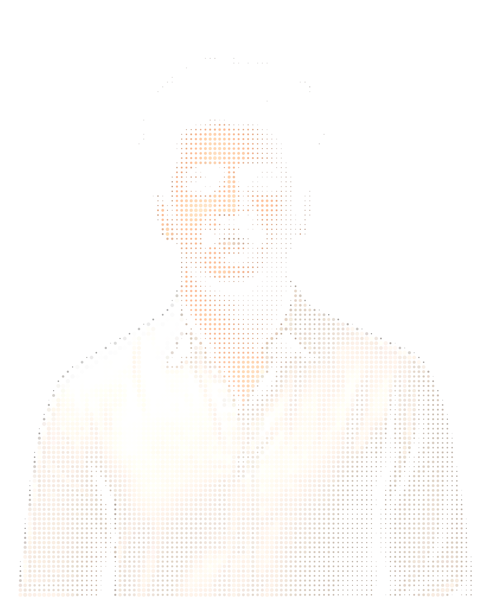
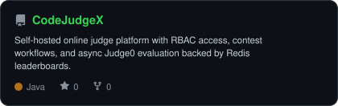

<div align="center">

<!-- ════════════════════ HEADER ════════════════════ -->

<table>
<tr>
<td width="28%" align="center">

</td>
<td width="72%" valign="top">

</td>
</tr>
</table>

<a href="https://git.io/typing-svg">
  
</a>

<br/>

<!-- ════════════════════ SOCIAL ════════════════════ -->

<a href="https://linkedin.com/in/abhiram-jonnadula"></a>
<a href="mailto:abhiram.j2006@gmail.com"></a>
<a href="https://github.com/Abhiram1106"></a>
<a href="https://abhiram-jonnadula.me"></a>


</div>

<br/>

<!-- ════════════════════ ABOUT ════════════════════ -->

```typescript
const abhiram = {
  role: "Full-Stack Developer (Backend-First)",
  location: "Andhra Pradesh, India 🇮🇳",
  currently: "Shipping production apps @ Technopose",
  focus: ["Scalable REST APIs", "Auth Systems", "Clean Architecture"],
  philosophy: "fast under load · secure by default · maintainable at scale",
  openTo: ["Internships", "Startup Roles", "Open-Source Collabs"],
};
```

<br/>

<div align="center">

<!-- ════════════════════ STAT CARDS ════════════════════ -->

<table>
<tr>
<td align="center" width="25%">
  <br/>
</td>
<td align="center" width="25%">
  <br/>
</td>
<td align="center" width="25%">
  <br/>
</td>
<td align="center" width="25%">
  <br/>
</td>
</tr>
</table>

</div>

<br/>

<!-- ════════════════════ TECH STACK ════════════════════ -->

## &nbsp;⚙️&nbsp; Tech Stack

<table>
<tr>
<td valign="top" width="50%">

#### &nbsp;Languages
<p>


</p>

#### &nbsp;Backend
<p>

</p>
<p>


</p>

#### &nbsp;Frontend
<p>

</p>

</td>
<td valign="top" width="50%">

#### &nbsp;Databases & Cache
<p>

</p>

#### &nbsp;AI / ML
<p>


</p>

#### &nbsp;DevOps & Tools
<p>

</p>
<p>


</p>

</td>
</tr>
</table>
<br/>

<!-- ════════════════════ RADAR CHARTS ════════════════════ -->

## &nbsp;🎯&nbsp; Skill Radar

<div align="center">
<table>
<tr>
<td width="50%" align="center">
<picture>
<source media="(prefers-color-scheme: dark)" srcset="assets/radar-dark.svg">
<source media="(prefers-color-scheme: light)" srcset="assets/radar-light.svg">

</picture>
</td>
<td width="50%" align="center">
<picture>
<source media="(prefers-color-scheme: dark)" srcset="assets/radar-langs-dark.svg">
<source media="(prefers-color-scheme: light)" srcset="assets/radar-langs-light.svg">

</picture>
</td>
</tr>
</table>
</div>

<br/>

<!-- ════════════════════ EXPERIENCE ════════════════════ -->

## &nbsp;💼&nbsp; Experience

<table>
<tr>
<td width="180" valign="top">
  <br/>
  <sub><b>Technopose</b></sub>
</td>
<td valign="top">
  <b>Software Developer (Full Stack)</b> &nbsp;·&nbsp; <i>Live product: Vizag Forever app</i>
  <ul>
    <li>Built & maintained REST APIs with <b>NestJS, PostgreSQL/TypeORM, JWT</b> + Swagger docs</li>
    <li>Converted Figma designs into responsive <b>React / React Native</b> screens</li>
    <li>Owned delivery end-to-end — design → implementation → production support</li>
  </ul>
</td>
</tr>
</table>

<br/>

<!-- ════════════════════ PROJECTS ════════════════════ -->

## &nbsp;🚀&nbsp; Featured Projects

<div align="center">
<table>
<tr>
<td width="33%" align="center">
<a href="https://github.com/Abhiram1106/CodeJudgeX">
<picture>
<source media="(prefers-color-scheme: dark)" srcset="assets/card-CodeJudgeX-dark.svg">
<source media="(prefers-color-scheme: light)" srcset="assets/card-CodeJudgeX-light.svg">

</picture>
</a>
</td>
<td width="33%" align="center">
<a href="https://github.com/Abhiram1106/SmartCare-Plus">
<picture>
<source media="(prefers-color-scheme: dark)" srcset="assets/card-SmartCare-Plus-dark.svg">
<source media="(prefers-color-scheme: light)" srcset="assets/card-SmartCare-Plus-light.svg">

</picture>
</a>
</td>
<td width="33%" align="center">
<a href="https://github.com/Abhiram1106/CareerOS">
<picture>
<source media="(prefers-color-scheme: dark)" srcset="assets/card-CareerOS-dark.svg">
<source media="(prefers-color-scheme: light)" srcset="assets/card-CareerOS-light.svg">

</picture>
</a>
</td>
</tr>
</table>
</div>

<br/>

<!-- ════════════════════ ANALYTICS ════════════════════ -->

## &nbsp;📊&nbsp; GitHub Analytics

<div align="center">
<picture>
<source media="(prefers-color-scheme: dark)" srcset="assets/card-stats-dark.svg">
<source media="(prefers-color-scheme: light)" srcset="assets/card-stats-light.svg">

</picture>
</div>

<br/>

<!-- ════════════════════ RECOGNITION ════════════════════ -->

## &nbsp;🏆&nbsp; Recognition & Certifications

<table>
<tr>
<td valign="top" width="50%">

**🎖️ Achievements**
- 🥇 **Finalist** — HackXlerate 2025, byteXL National (top finalists / 1000+)
- 🥈 **2nd Place** — VFSTR Project Expo 2024
- 🏅 **Semi-Finalist** — Amaravathi Quantum Valley Hackathon

</td>
<td valign="top" width="50%">

**📜 Certifications**
- 📘 DBMS — NPTEL, IIT Kharagpur
- 🔐 Qualys Certified Specialist — Vulnerability Management
- 🌐 Cambridge English B1 Preliminary
- 🐙 GitHub Foundations

</td>
</tr>
</table>

<br/>

<!-- ════════════════════ FOOTER ════════════════════ -->

<div align="center">

### 💬 Let's build something that scales.

<a href="https://linkedin.com/in/abhiram-jonnadula"></a>
<a href="mailto:abhiram.j2006@gmail.com"></a>


</div>