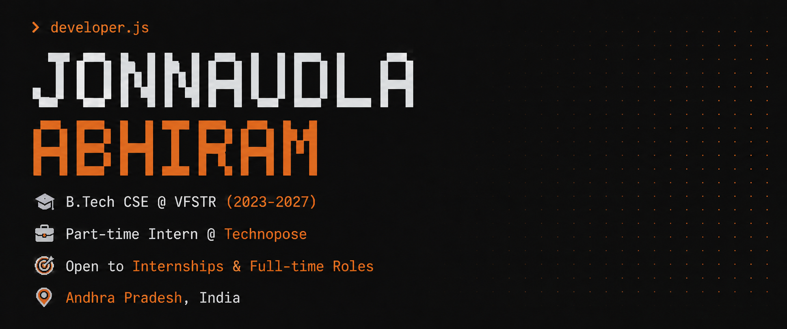
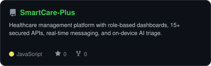
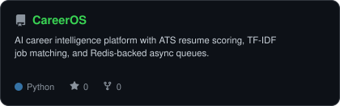
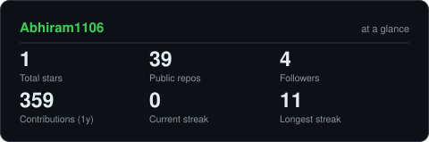

<!-- ════════════════════ HEADER ════════════════════ -->

 

<!-- ════════════════════ SOCIAL ════════════════════ -->

 

<!-- ════════════════════ TECH STACK ════════════════════ -->

## &nbsp;⚙️&nbsp; Tech Stack

<table border="0" cellspacing="0" cellpadding="0" width="100%">
<tr>
<td width="50%" align="center" valign="top">

**Languages**
 

  

**Frontend**
 

  

**Backend**
 

 

  

**Databases**
 

</td>
<td width="50%" align="center" valign="top">

**Tools**
 

  

**Concepts**
 

  

**Used at Technopose (internship)**
 

  

**🌱 Currently Exploring**
 

</td>
</tr>
</table>

 

<!-- ════════════════════ RADAR CHARTS ════════════════════ -->

## &nbsp;🎯&nbsp; Skill Radar

<table border="0" cellspacing="0" cellpadding="0" width="100%">
<tr>
<td width="50%" align="center">
<picture>
<source media="(prefers-color-scheme: dark)" srcset="assets/radar-dark.svg">
<source media="(prefers-color-scheme: light)" srcset="assets/radar-light.svg">

</picture>
</td>
<td width="50%" align="center">
<picture>
<source media="(prefers-color-scheme: dark)" srcset="assets/radar-langs-dark.svg">
<source media="(prefers-color-scheme: light)" srcset="assets/radar-langs-light.svg">

</picture>
</td>
</tr>
</table>

 

<!-- ════════════════════ EXPERIENCE ════════════════════ -->

## &nbsp;💼&nbsp; Experience

<table border="0" cellspacing="0" cellpadding="0" width="100%">
<tr>
<td width="180" valign="top">
   
  <b>Technopose</b> 
  <i>early-stage startup</i>
</td>
<td valign="top">
  <b>Software Development Intern (Part-time)</b> &nbsp;·&nbsp; <i>Live product: Vizag Forever</i>
  <ul>
    <li>Built and shipped core product features for <b>Vizag Forever</b>, a consumer app live on the Play Store, using <b>React Native</b> on a shared TypeScript codebase</li>
    <li>Developed backend features on a <b>Node.js / NestJS</b> stack integrating <b>PostgreSQL (AWS RDS)</b> and <b>Redis</b> caching, with endpoints documented via Swagger</li>
    <li>Collaborated with designers, engineers, and product in an <b>Agile/Scrum</b> team — bug triage, CI/CD pipelines (GitHub Actions), and release cycles</li>
  </ul>
</td>
</tr>
</table>

 

<!-- ════════════════════ PROJECTS ════════════════════ -->

## &nbsp;🚀&nbsp; Featured Projects

<table border="0" cellspacing="0" cellpadding="0" width="100%">
<tr>
<td width="50%" align="center">
<a href="https://github.com/Abhiram1106/SmartCare-Plus">
<picture>
<source media="(prefers-color-scheme: dark)" srcset="assets/card-SmartCare-Plus-dark.svg">
<source media="(prefers-color-scheme: light)" srcset="assets/card-SmartCare-Plus-light.svg">

</picture>
</a>
</td>
<td width="50%" align="center">
<a href="https://github.com/Abhiram1106/CareerOS">
<picture>
<source media="(prefers-color-scheme: dark)" srcset="assets/card-CareerOS-dark.svg">
<source media="(prefers-color-scheme: light)" srcset="assets/card-CareerOS-light.svg">

</picture>
</a>
</td>
</tr>
</table>

 

<!-- ════════════════════ GITHUB ACTIVITY ════════════════════ -->

## &nbsp;📊&nbsp; GitHub Activity

<picture>
<source media="(prefers-color-scheme: dark)" srcset="assets/card-stats-dark.svg">
<source media="(prefers-color-scheme: light)" srcset="assets/card-stats-light.svg">

</picture>

  

  

 

<!-- ════════════════════ RECOGNITION ════════════════════ -->

## &nbsp;🏆&nbsp; Recognition & Certifications

<table border="0" cellspacing="0" cellpadding="0" width="100%">
<tr>
<td valign="top" width="50%">

**🎖️ Achievements**
- 🥇 **Finalist** — HackXlerate 2025, byteXL National Hackathon at T-Hub Hyderabad
- 🥈 **2nd Place** — VFSTR Project Expo 2024, Full-Stack Development Track
- 🏅 **Semi-Finalist** — Amaravathi Quantum Valley Hackathon, Govt. of Andhra Pradesh

</td>
<td valign="top" width="50%">

**📜 Certifications**
- 📘 Database Management Systems — NPTEL, IIT Kharagpur
- 🌐 Cambridge English B1 Preliminary
- 🐙 GitHub Foundations

</td>
</tr>
</table>

 

<!-- ════════════════════ FOOTER ════════════════════ -->

### 💬 Let's build something that scales.

