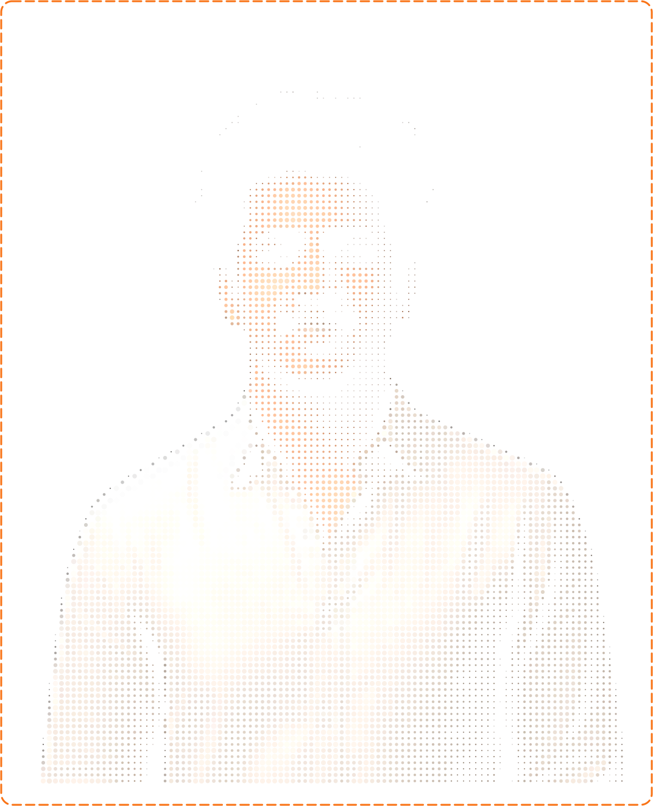

<div align="center">

<!-- ════════════════════ HEADER ════════════════════ -->

<table>
<tr>
<td width="28%" align="center">

</td>
<td width="72%" valign="top">

</td>
</tr>
</table>

<a href="https://git.io/typing-svg">
  
</a>

<br/>

<!-- ════════════════════ SOCIAL ════════════════════ -->

<a href="https://linkedin.com/in/abhiram-jonnadula"></a>
<a href="mailto:abhiram.j2006@gmail.com"></a>
<a href="https://github.com/Abhiram1106"></a>
<a href="https://abhiram-jonnadula.me"></a>


</div>

<br/>

<!-- ════════════════════ SNAKE ════════════════════ -->

## &nbsp;🐍&nbsp; Contribution Snake


<br/>

<!-- ════════════════════ ABOUT ════════════════════ -->

```typescript
const abhiram = {
  role: "Full-Stack Developer (Java + MERN)",
  location: "Andhra Pradesh, India 🇮🇳",
  currently: "Building Vizag Forever @ Technopose (React Native + NestJS)",
  focus: ["REST APIs", "Auth Systems", "DSA on LeetCode"],
  learning: ["AWS (EC2, S3)", "System Design fundamentals"],
  openTo: ["Software Engineer Roles — full-time, graduating 2027"],
};
```

<br/>

<div align="center">

<!-- ════════════════════ STAT CARDS ════════════════════ -->

<table>
<tr>
<td align="center" width="25%">
  <br/>
</td>
<td align="center" width="25%">
  <br/>
</td>
<td align="center" width="25%">
  <br/>
</td>
<td align="center" width="25%">
  <br/>
</td>
</tr>
</table>

</div>

<br/>

<!-- ════════════════════ CONTRIBUTION CALENDAR ════════════════════ -->

## &nbsp;📅&nbsp; Contribution Calendar

<div align="center">


<br/><br/>


</div>

<br/>

<!-- ════════════════════ TECH STACK ════════════════════ -->

## &nbsp;⚙️&nbsp; Tech Stack

<table>
<tr>
<td valign="top" width="50%">

#### &nbsp;Languages
<p>

</p>

#### &nbsp;Frontend
<p>

</p>

#### &nbsp;Backend
<p>

</p>
<p>


</p>

#### &nbsp;Databases
<p>

</p>

</td>
<td valign="top" width="50%">

#### &nbsp;Tools
<p>

</p>

#### &nbsp;Concepts
<p>


</p>

#### &nbsp;Used at Technopose (internship)
<p>

</p>

#### &nbsp;🌱 Currently Exploring
<p>


</p>

</td>
</tr>
</table>

<br/>

<!-- ════════════════════ RADAR CHARTS ════════════════════ -->

## &nbsp;🎯&nbsp; Skill Radar

<div align="center">
<table>
<tr>
<td width="50%" align="center">
<picture>
<source media="(prefers-color-scheme: dark)" srcset="assets/radar-dark.svg">
<source media="(prefers-color-scheme: light)" srcset="assets/radar-light.svg">

</picture>
</td>
<td width="50%" align="center">
<picture>
<source media="(prefers-color-scheme: dark)" srcset="assets/radar-langs-dark.svg">
<source media="(prefers-color-scheme: light)" srcset="assets/radar-langs-light.svg">

</picture>
</td>
</tr>
</table>
</div>

<br/>

<!-- ════════════════════ EXPERIENCE ════════════════════ -->

## &nbsp;💼&nbsp; Experience

<table>
<tr>
<td width="180" valign="top">
  <br/>
  <sub><b>Technopose</b></sub><br/>
  <sub><i>early-stage startup</i></sub>
</td>
<td valign="top">
  <b>Software Development Intern (Part-time)</b> &nbsp;·&nbsp; <i>Live product: Vizag Forever</i>
  <ul>
    <li>Built and shipped core product features for <b>Vizag Forever</b>, a consumer app live on the Play Store, using <b>React Native</b> on a shared TypeScript codebase</li>
    <li>Developed backend features on a <b>Node.js / NestJS</b> stack integrating <b>PostgreSQL (AWS RDS)</b> and <b>Redis</b> caching, with endpoints documented via Swagger</li>
    <li>Collaborated with designers, engineers, and product in an <b>Agile/Scrum</b> team — bug triage, CI/CD pipelines (GitHub Actions), and release cycles</li>
  </ul>
</td>
</tr>
</table>

<br/>

<!-- ════════════════════ PROJECTS ════════════════════ -->

## &nbsp;🚀&nbsp; Featured Projects

<div align="center">
<table>
<tr>
<td width="50%" align="center">
<a href="https://github.com/Abhiram1106/SmartCare-Plus">
<picture>
<source media="(prefers-color-scheme: dark)" srcset="assets/card-SmartCare-Plus-dark.svg">
<source media="(prefers-color-scheme: light)" srcset="assets/card-SmartCare-Plus-light.svg">

</picture>
</a>
</td>
<td width="50%" align="center">
<a href="https://github.com/Abhiram1106/CareerOS">
<picture>
<source media="(prefers-color-scheme: dark)" srcset="assets/card-CareerOS-dark.svg">
<source media="(prefers-color-scheme: light)" srcset="assets/card-CareerOS-light.svg">

</picture>
</a>
</td>
</tr>
</table>
</div>

<sub>

**SmartCare Plus** — Healthcare management platform (React, Node.js, Express, MongoDB, Socket.io, JWT). Role-scoped Admin/Doctor/Patient dashboards, JWT + RBAC, live appointment updates via Socket.io, flexible specialty-specific patient record schemas.

**CareerOS** — Resume-to-job matching platform (React, Node.js, Express, MongoDB, JWT). Parses resumes and job descriptions to generate a match score and missing-skills list, with REST APIs handling uploads, parsing, and scoring.

</sub>

<br/>

<!-- ════════════════════ ANALYTICS ════════════════════ -->

## &nbsp;📊&nbsp; GitHub Analytics

<div align="center">
<picture>
<source media="(prefers-color-scheme: dark)" srcset="assets/card-stats-dark.svg">
<source media="(prefers-color-scheme: light)" srcset="assets/card-stats-light.svg">

</picture>
</div>

<br/>

<!-- ════════════════════ RECOGNITION ════════════════════ -->

## &nbsp;🏆&nbsp; Recognition & Certifications

<table>
<tr>
<td valign="top" width="50%">

**🎖️ Achievements**
- 🥇 **Finalist** — HackXlerate 2025, byteXL National Hackathon at T-Hub Hyderabad
- 🥈 **2nd Place** — VFSTR Project Expo 2024, Full-Stack Development Track
- 🏅 **Semi-Finalist** — Amaravathi Quantum Valley Hackathon, Govt. of Andhra Pradesh

</td>
<td valign="top" width="50%">

**📜 Certifications**
- 📘 Database Management Systems — NPTEL, IIT Kharagpur
- 🌐 Cambridge English B1 Preliminary
- 🐙 GitHub Foundations

</td>
</tr>
</table>

<br/>

<!-- ════════════════════ FOOTER ════════════════════ -->

<div align="center">

### 💬 Let's build something that scales.

<a href="https://linkedin.com/in/abhiram-jonnadula"></a>
<a href="mailto:abhiram.j2006@gmail.com"></a>


</div>